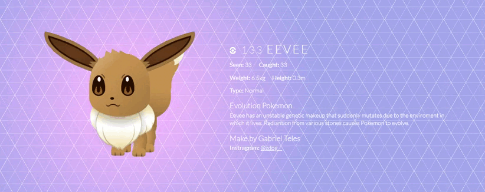

 

<h1 align="center">
    
SCSS EEVEE

</h1>

## 🧪 Tecnologias

Esse projeto foi desenvolvido com as seguintes tecnologias:

- [HTML](https://html.com/)
- [SCSS](https://sass-lang.com/)

## 🚀 Como executar

Abrir o link para rodar o projeto.

- [CODEOPEN](https://codepen.io/zdog10127/pen/RwBMXoZ)

## 💻 Projeto

Uma animação do pokemon eevee em scss e html. 

## 📝 License

Esse projeto está sob a licença MIT. Veja o arquivo [LICENSE](LICENSE.md) para mais detalhes.
